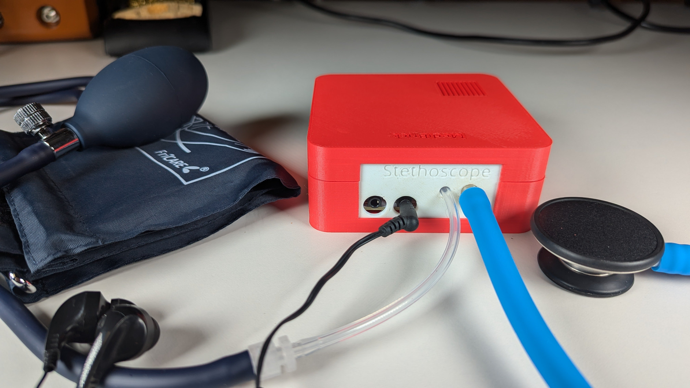
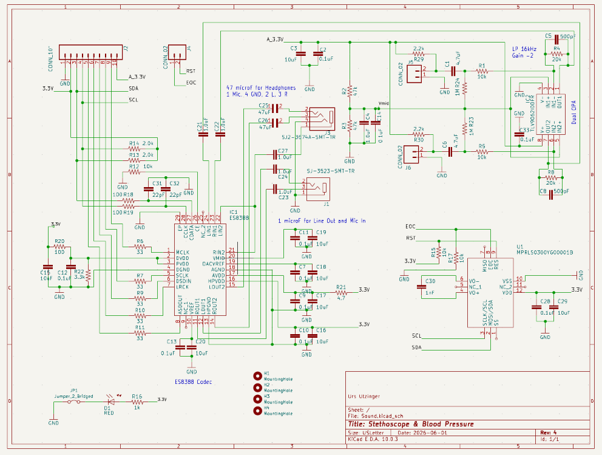
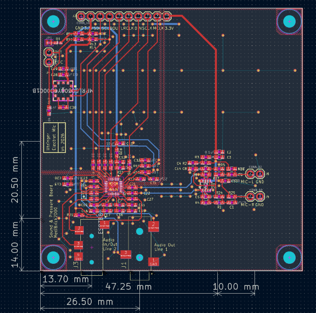
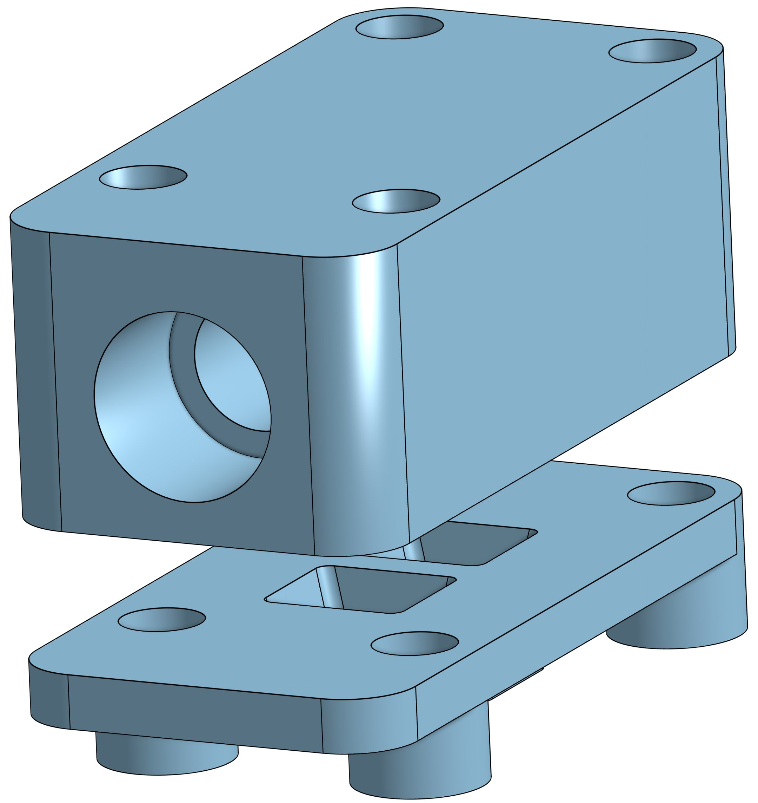

# Stethoscope with Pressure Sensor

The stethoscope and blood pressure brick consists of a sound as well as pressure recorder. For sound the I2S (Inter-Integrated Circuit Sound) bus is used to communicate with the microcontroller. This interface allows streaming and recording audio to an audio codec board. The Everest Semiconductor [ES8388 audio codec](datasheets/ES8388%20DS.pdf) was chosen because its supported by Arduino Audio Tools library and Arduino Audio Driver and because Espressif created the Lyrat Audio modules with published reference [designs](datasheets/esp32-lyrat-v4-schematic.pdf).

Sound was recorded with pui audio analog MEMS microphones [AMM-2742](datasheets/Microphone-AMM-2742-T-R.pdf) that are mounted on the printed circuit board.

However a new design is developed to use electret microphones that are attached to the flexible stethoscope tubing.

Two microphones are used where one is connected to the stethoscope and the other recording the background. An [dual differential amplifier](datasheets/opa344.pdf) is used to low pass filter and amplify the signal from the microphone, however amplification would not be needed for the ES8388 codec. Pressure is measured with a Honeywell MPR pressure sensor [MPRLS0300YG](datasheets/MPR_Pressure_HWSC_S_A0016036563_1-3073392.pdf) that convers the physiological range of 0 to 200 mm Hg.

## Costs &#36;

| Item        | Quantity at Purchase | Costs  | Source            | Cost per Brick
|---                          | ---  | ---    | ---               | ---
| Microcontroller             |  1   | $17.5  | [Adafruit](https://www.adafruit.com/product/5477)          | $17.5
| Display                     |  5   | $13    | [Amazon](https://a.co/d/1QH0Ab9)            | $3
| Button                      | 25   | $9     | [Amazon](https://a.co/d/8KAuTwC) | $0.5 
| Battery                     |  1   | $10     | [Adafruit](https://www.adafruit.com/product/258)        | $10
| PCB                         |  5   | $45.18 | PCBWay            | $9
| Parts and Assembly          |  2   | $56.55 | PCBWay            | $29
| MPRLS0300YG (pressure)      |  2   | $35    | [DigiKey](https://www.digikey.com/en/products/detail/honeywell-sensing-and-productivity-solutions/MPRLS0300YG00001B/10231660) | $17.5
| PUI AOM-5024L-HD-R (microphone)  |  2  | $4.2 | [Mouser](https://mou.sr/43AdqZY) | $8.4
| 3.5mm Audio jack stereo out(*)   | 1 | $0.9 | [Mouser](https://mou.sr/4uOWvy2) | $0.9
| 3.5mm Audio jacl mic in & stereo out(*) | 1 | $1.2 | [Mouser](https://mou.sr/4fyV8PS) | $1.2 |
| Stethoscope                 |  1   | $25    | [Amazon](https://a.co/d/7tQgoKs) | $25
| Arm Cuff                    |  1   | $17    | [Amazon](https://a.co/d/gKueGYV) | $17
| Assorted Wires              |8m    | $15    | [Amazon](https://a.co/d/58djefc) | $1
| Assorted Screws and Nuts    |100   |  $7    | Amazon            | $0.05
| Silocone Tubing             |  1   |  $9    | [Amazon](https://a.co/d/5GLJtFr) | $2
| Luer Lock female 3/32 barb  | 10   |  $9    | [Amazon](https://a.co/d/hxruOyw) | $1
| Luer Lock male 5/32 barb    | 10   |  $8    | [Amazon](https://a.co/d/c4cmtBQ) | $1
| Stainless Steel Tubing      |250mm | $10    | Amazon            | $2 |
| Assorted 3D printed parts   |      |        |                   | $3
|  **(*)** if not available at manufacturer, DIY |
| **Total with blood pressure**     |      |        |                   | **$140**
| **Total without blood pressure**  |      |        |                   | **$100**

Electronic components, excluding the pressure sensor, are $14 per board.

The pressure sensor was mounted in-house as the PCB assembly service did not have access to an inexpensive source.

## Software &#128187;

Main Program in Arduino folder:

- MediBrick_Stethoscope_BP_Microcontroller_Software: Refer to [Microcontroller_Software.md](Microcontroller_Software.md) for installation and usage instructions.

Test software is located in Arduino folder.

- MediBrick_Stethoscope_ES8388_to_CSV:
Prints the two-channel audio signal to the serial port for visualization with SerialUI application.

- MediBrick_Stethoscope_ES8388_TestSound: Creates test tone in left and right channels for headphones.

- MediBrick_Stethoscope_ES8388_to_Headphone: Plays the recorded sound to the headphone.

- MediBrick_Stethoscope_PressureTest: Test the arm cuff pressure sensor.

## Electronics Design &#128268;

The following files are needed for PCB manufacturing and assembly at PCBWay.

- [Bill of Materials](KiCad/pcbway_production/2026-06-14-11-51-50/Sound.kicad_pcb_bom.csv)
- [Gerber Manufacturing Files](KiCad/pcbway_production/2026-06-14-11-51-50/Sound.kicad_pcb_gerber.zip)
- [Component Placement](KiCad/pcbway_production/2026-06-14-11-51-50/Sound.kicad_pcb_positions.csv)

The current design source is in [`KiCad`](KiCad/). The previous Eagle design is retained in [`Eagle`](Eagle/).

## 3D Printed Parts &#9881;
These are the links to the OnShape Design files, which you can edit and modify if you have an OnShape account (OnShape has free academic accounts).

- Microphone Housing
  - [Stethoscope Microphone Bottom](https://cad.onshape.com/documents/f23280f0a46d3d6c755669df/w/b75e085438cd92ba1b26b647/e/00c40c7437b1518e003bac9d)
  - [Stethoscope Microphone Top](https://cad.onshape.com/documents/ef2b037c38f1baa1c0b23c04/w/556b341c46d5852ab7c96559/e/758f32969c2d9c1e8976b746)

  

- MediBrick Casing (print each part separately) [This is not yet updated for new microphone]
  - [Brick Top/Board](https://cad.onshape.com/documents/ebcdcbc3e7eb802e05aa7127/w/92c7f2c4a3604ac0392e9e89/e/23d2cedb30284d3e07ce3fd7)
  - [Brick Bottom / Microcontroller](https://cad.onshape.com/documents/3fee40e68f3fb61ffdb812bb/w/65bb78ada38672d141a5d154/e/0ff82183503e2fd6c450e151)
  - [Stethoscope Interface Plate ](https://cad.onshape.com/documents/06546d5c2b6ecb0931149c5d/w/2aa54258cb58c3e795c7fea9/e/823e2851771a01788a8faacf)

## PCB Manufacturing Instructions &#128736;
When ordering at PCBWay:

Standard PCB
- Single pieces
- 70 x 70 mm
- 2 layers
- FR-4, TG 150-160
- Thickness 1.6 mm
- Minimum track width and spacing 0.15 mm
- Minimum through-hole diameter 0.25 mm
- No edge connectors
- Surface finish ENIG, 1U"
- Via process: Tenting Vias
- 1 oz Cu

Assembly Service
- Turnkey
- Single pieces
- Top side

Other Parameters
- Use the current BOM and component-placement files linked above for part counts
- Number of BGA/QFN parts: 1
- Through-hole connectors are installed separately

Customized Services and Advanced Options
- Leave as is

## Assembly Instructions &#128736;
  - [Assembly Instructions](./Assembly.md) 
 
## Audio Filters

The firmware provides adjustable high-pass and low-pass filters, software gain, and two-channel noise cancellation. These settings can be changed through the serial command interface described in [Microcontroller_Software.md](Microcontroller_Software.md).

The older offline filter-analysis utility remains available in [Compute_Filter_Coefficients.py](Compute_Filter_Coefficients.py).
